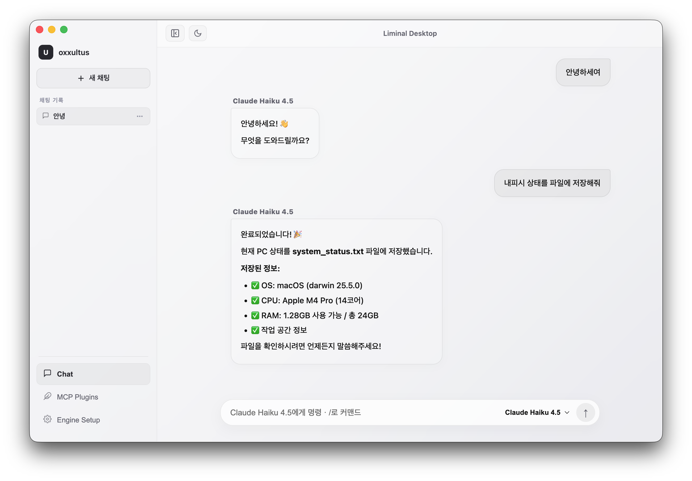
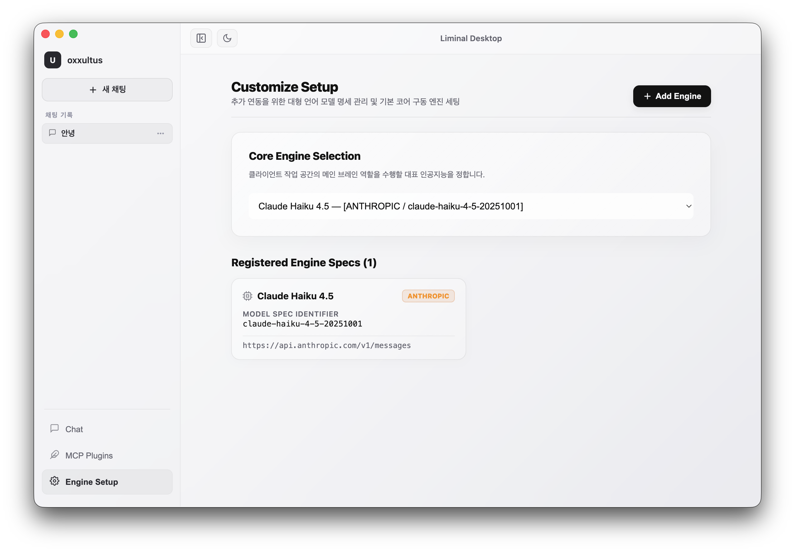
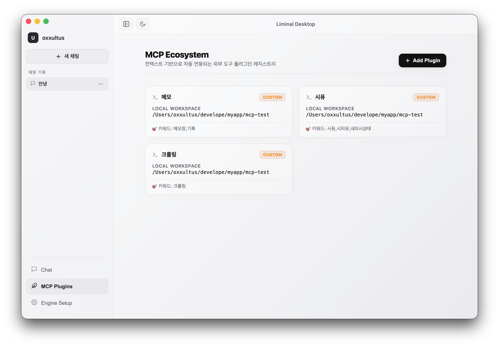
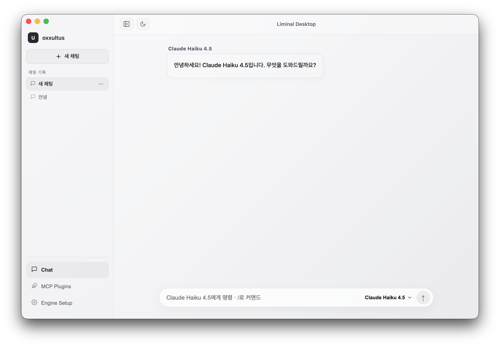
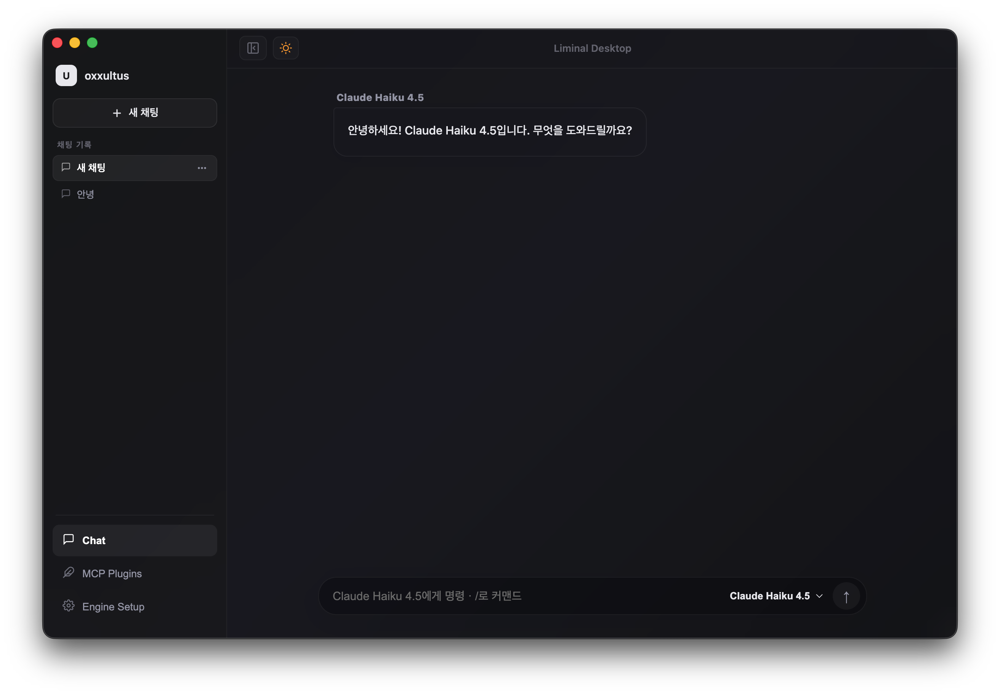

# Liminal Desktop

> 다중 LLM 엔진과 MCP 플러그인을 하나의 워크스페이스에서 운용하는 AI 데스크탑 클라이언트



<br>

## 목차

- [소개](#소개)
- [화면 미리보기](#화면-미리보기)
- [호환성](#호환성)
- [설치](#설치)
- [엔진 등록](#엔진-등록)
- [플러그인 작성 가이드](#플러그인-작성-가이드)
- [라이선스](#라이선스)

<br>

## 소개

Liminal Desktop은 OpenAI, Anthropic, Google 등 다양한 LLM 공급자를 단일 인터페이스에서 전환하며 사용할 수 있는 Electron 기반 데스크탑 앱입니다. MCP(Model Context Protocol) 플러그인 시스템을 통해 AI가 외부 도구와 파일 시스템에 직접 접근할 수 있습니다.

**주요 기능**

- 다중 LLM 엔진 등록 및 실시간 전환
- 채팅 세션 관리 및 대화 히스토리 압축 요약
- MCP 플러그인 에코시스템 (원격 / 로컬 / 다운로드)
- 슬래시 커맨드(`/clear`, `/summary`, `/engine` 등)
- 다크 / 라이트 테마 전환

<br>

## 화면 미리보기

| 채팅 워크스페이스 | 엔진 설정 | 플러그인 매니저 |
|:-:|:-:|:-:|
|  |  |  |

| 라이트 모드 | 다크 모드 |
|:-:|:-:|
|  |  |

<br>

## 호환성

### 운영체제

| OS | 버전 | 지원 여부 |
|---|---|:---:|
| macOS | 13 Ventura 이상 | ✅ |
| Windows | 10 / 11 (x64) | ✅ |
| Linux | Ubuntu 22.04 이상 | ✅ |

### LLM 공급자

| Provider | 확인된 모델 | 비고 |
|---|---|---|
| **OpenAI** | gpt-4o, gpt-4-turbo, gpt-3.5-turbo | Function Calling 지원 |
| **Anthropic** | claude-opus-4, claude-sonnet-4, claude-haiku-4 | Tool Use 지원 |
| **Google** | gemini-2.0-flash, gemini-1.5-pro | Function Declaration 지원 |
| **기타** | OpenAI 호환 API | `v1/chat/completions` 엔드포인트 사용 가능 |

### 런타임

| 항목 | 요구 버전 |
|---|---|
| Node.js | 20.x 이상 |
| Electron | 28.x 이상 |
| npm | 9.x 이상 |

<br>

## 설치

```bash
# 저장소 클론
git clone https://github.com/yourname/liminal-desktop.git
cd liminal-desktop

# 의존성 설치
npm install

# 개발 서버 실행
npm run dev

# 프로덕션 빌드
npm run build
```

<br>

## 엔진 등록

1. 우측 상단 **Add Engine** 버튼 클릭
2. Provider, 엔진 이름, 엔드포인트 URL, 모델 식별자, API Key 입력
3. **Activate Engine** 으로 저장
4. Settings > Core Engine Selection 에서 기본 엔진 지정

```
Provider:  openai
Name:      GPT-4o
URL:       https://api.openai.com/v1
Model:     gpt-4o
API Key:   sk-...
```

<br>

## 플러그인 작성 가이드

Liminal Desktop의 플러그인은 CommonJS 스펙(`module.exports`)을 따르는 순수 자바스크립트 파일(`*.js`)입니다.
AI가 유저의 문맥을 파악해 도구를 선택하고, 안전한 격리 공간(Sandbox) 안에서 실행되도록 아래 4가지 필수 구조를 반드시 구현해야 합니다.

### 플러그인 유형

| 유형 | 설명 | 용도 |
|---|---|---|
| `remote` | HTTP 엔드포인트로 외부 서버에 연결 | 사내 API, 외부 SaaS 연동 |
| `custom` | URL에서 JS 스크립트를 다운로드하여 실행 | 배포된 공개 플러그인 |
| `custom` | 로컬 `.js` 파일을 직접 연결 | 직접 작성한 커스텀 도구 |

---

### 표준 템플릿

새 플러그인을 만들 때 아래 구조를 복사해 비즈니스 로직을 채워 넣으세요.

```js
// my-mcp-plugin.js
const fs = require('fs/promises');
const path = require('path');

module.exports = {

  // 1. 메타데이터 ─────────────────────────────────────────────────────────
  id: "mcp-custom-tool",      // 시스템 내부 고유 영문 ID (중복 불가)
  name: "커스텀 기능 확장 툴", // UI에 노출되는 이름


  // 2. 동적 필터링 키워드 ──────────────────────────────────────────────────
  // 유저 프롬프트에 아래 단어가 포함될 때만 이 플러그인의 도구가 AI에 주입됩니다.
  // 비워두거나 선언하지 않으면 모든 대화에서 상시 대기합니다.
  keywords: ['샘플', '데이터', '테스트', 'sample', 'data'],


  // 3. AI 주입용 도구 명세 (JSON Schema) ────────────────────────────────────
  async listTools() {
    return [
      {
        name: 'execute_sample_job',
        // AI가 도구 사용 여부를 판단하는 핵심 기준문 — 구체적으로 작성할수록 정확도가 높아집니다.
        description: '[샘플] 지정된 작업 공간에 파일을 생성하고 데이터를 기록합니다.',
        inputSchema: {
          type: 'object',
          properties: {
            targetName: {
              type: 'string',
              description: '생성할 파일명 (예: result.json)'
            },
            payload: {
              type: 'string',
              description: '파일에 기록할 본문 데이터'
            }
          },
          required: ['targetName', 'payload']
        }
      }
    ];
  },


  // 4. 도구 실행 핸들러 ────────────────────────────────────────────────────
  /**
   * @param {string} name    - 호출된 도구 이름 (네임스페이스 접두사 제거 상태)
   * @param {object} args    - AI가 JSON Schema에 맞춰 조립한 인자 값
   * @param {object} context - Electron 메인 프로세스가 주입하는 환경 변수
   *   context.workspaceDir  - 유저가 등록 시 지정한 실제 파일 작업 공간 경로
   */
  async callTool(name, args, context) {
    const workspaceDir = context?.workspaceDir || './workspace';

    try {
      if (name.endsWith('execute_sample_job')) {
        const filePath = path.join(workspaceDir, args.targetName);

        // 🛡️ 보안 필수: Directory Traversal Attack 방어
        // ../../ 등으로 상위 경로를 타고 올라가는 시도를 원천 차단합니다.
        if (!filePath.startsWith(workspaceDir)) {
          throw new Error('샌드박스 작업 공간 외부 경로에는 접근할 수 없습니다.');
        }

        await fs.mkdir(workspaceDir, { recursive: true });
        await fs.writeFile(filePath, args.payload, 'utf-8');

        // 💡 리턴 포맷 규격: 반드시 아래 구조를 준수해야 LLM이 결과를 인식합니다.
        return {
          content: [
            {
              type: 'text',
              text: `✅ [${workspaceDir}] 안에 [${args.targetName}] 파일 작성을 완료했습니다.`
            }
          ]
        };
      }

      throw new Error(`구현되지 않은 도구 호출: ${name}`);

    } catch (error) {
      // 에러는 반드시 잡아서 문자열로 반환 — 앱 전체가 죽지 않도록 격리합니다.
      return {
        content: [{ type: 'text', text: `❌ 플러그인 실행 실패: ${error.message}` }]
      };
    }
  }
};
```

---

### 핵심 아키텍처 메커니즘

#### 1. 동적 문맥 필터링 (토큰 절약)

플러그인의 `keywords` 배열과 유저 메시지를 실시간으로 대조해, 관련 있는 도구만 AI에 주입합니다.

```
유저: "사양 체크해줘"  →  keywords: ['사양', '시스템'] 인 플러그인만 활성화
유저: "파일 저장해줘"  →  keywords: ['파일', '저장'] 인 플러그인만 활성화
keywords 미선언       →  상시 대기조 — 모든 대화에서 항상 포함
```

#### 2. 파괴적 명령 관문 제어 (Confirm 인터셉터)

도구 이름이 `write_text_file` 또는 `delete_file`로 끝나는 경우, 실행 직전 Electron 네이티브 경고 팝업이 강제로 트리거됩니다. 유저가 승인해야만 `callTool`로 명령이 전달됩니다.

```
AI 도구 호출 요청
      ↓
도구명 ends with 'write_text_file' | 'delete_file' ?
      ↓ YES
  Electron confirm() 팝업 → 유저 승인
      ↓
  callTool() 실행
```

#### 3. 런타임 캐시 킬러 (핫 리로드)

플러그인 코드를 수정한 뒤 앱을 재시작할 필요가 없습니다.

1. Plugin Manager에서 해당 플러그인 **삭제**
2. 동일한 경로로 **재등록 (Link & Activate)**

시스템이 `require.cache`를 자동으로 초기화하여 변경된 최신 코드를 즉시 반영합니다.

---

### `inputSchema` 파라미터 타입 레퍼런스

```js
properties: {
  // 문자열
  filename: { type: 'string', description: '파일명 (확장자 포함)' },

  // 숫자
  count: { type: 'number', description: '최대 항목 수', default: 10 },

  // 불리언
  overwrite: { type: 'boolean', description: '덮어쓰기 여부' },

  // 열거형
  format: { type: 'string', enum: ['json', 'csv', 'txt'], description: '출력 포맷' },

  // 배열
  tags: { type: 'array', items: { type: 'string' }, description: '태그 목록' }
}
```

---

### 등록 방법 (local 타입 기준)

1. Plugin Manager > **Add Plugin** 클릭
2. Plugin Type → `Local Script File` 선택
3. 작성한 `.js` 파일 경로 지정 (파일 탐색 버튼 사용 가능)
4. 플러그인이 접근할 **Workspace 디렉토리** 절대경로 입력
5. 트리거 키워드 입력 (쉼표 구분, 비워두면 상시 대기)
6. **Link & Activate** 클릭

---

### 작성 체크리스트

- [ ] `id`가 다른 플러그인과 중복되지 않는가
- [ ] `listTools()`의 각 도구에 `description`을 구체적으로 작성했는가
- [ ] `inputSchema`의 `required` 배열이 정확한가
- [ ] `callTool()`에서 모든 도구 이름 케이스를 처리했는가
- [ ] Directory Traversal 방어 코드가 포함되어 있는가
- [ ] 에러를 `try/catch`로 감싸고 `content` 포맷으로 반환하는가
- [ ] 파일 접근은 `context.workspaceDir` 내부로만 제한했는가

<br>

## 라이선스

MIT License © 2025 oxxultus